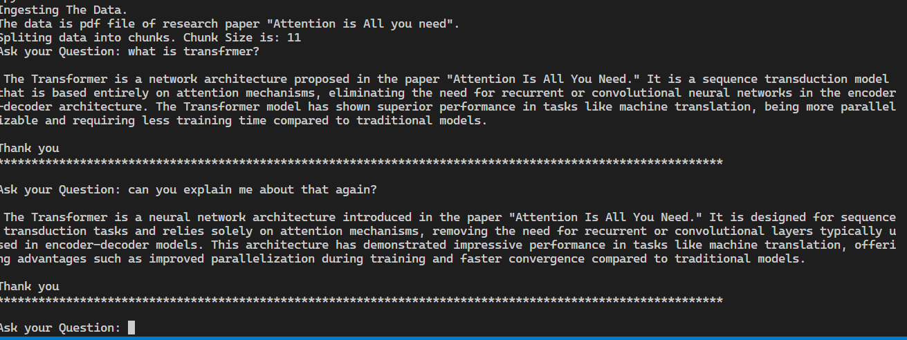
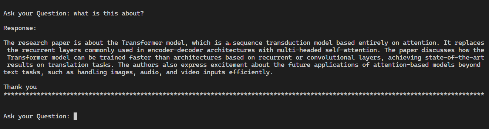
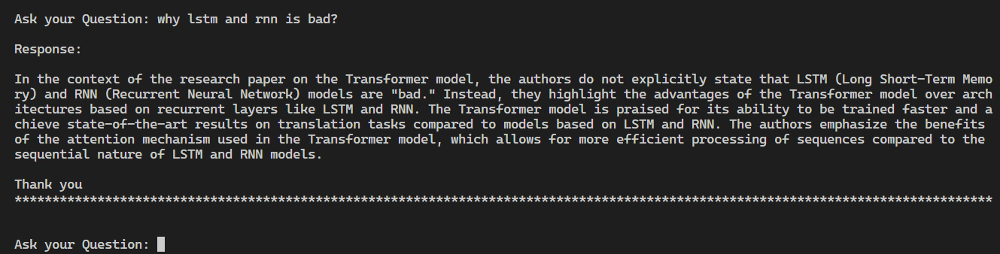

# LLM Document CLI Bot with Rag

A cli based chatbot which helps in reading the context of given documents (PDF).

## Introduction
Welcome to chatbot system! This README file will guide you through the setup, configuration, and usage instructions for the system. Additionally, it will provide details on integrating Vectordatabase and the default embedding model with an alternative one.

## Installation

📥 Clone the repo using git:

```shell
git clone https://github.com/sumanpaudel1997/LLM-Document-Bot-with-Rag.git
```

Now to get started, follow these steps:

- **Using Python**:
    - 1. Clone this repository.
    - 2. Create virtual environment using `python -m venv venv`
    - 3. Create `.env` file and save your `OPENAI_API_KEY=<yourkey>` on it.
    - 4. If you don't have virtual envrionment the install using `pip install virtualenv`
    - 5. Activate virtual envrionment `source venv/bin/activate`
    - 6. Install the required dependencies using `pip install -r requirements.txt`
    - 7. After successfull installtion run the application with `python main.py`

- **Using Docker**:
    - 1. create a `.env` file add your api_key OPENAI_API_KEY='yoursecretkey' or do `export OPENAI_API_KEY=<yourkey>`
    - 2. Now build the image using your api key `docker build --build-arg OPENAI_API_KEY=$OPENAI_API_KEY -t <image name> .`
    - 3. Now run the python application using  `docker run -it --name my_app --rm <image name>`

## Usage

- Use the app to do query the pdf file.
- The app is purely CLI based where users are prompted to ask the question of their files.
- The app understands the context you are providing with respect to pdf file.
- You can insert your custom pdf file into a folder >> `data/docs/yourfile.pdf`

## Folder Structure
- **data**: This directory contains all the data files required for the project. 
- **qdrant**: A folder containing qdrant local instance to save the vector emebeddings.
- **utils**: A directory containing utility scripts that are used across the project.
    - `vector_index.py`: Used for creating and managing vector indices.
    - `data_ingestion.py`: This script is used for ingesting data into the application.
    - `qdrant_db.py`: Handles operations related to 'qdrant' database.
- **storage_index**: Folder containing files that stores storage context container which is a utility container for storing nodes, indices, and vectors.
- `requirement.txt` : all of the dependencies needed to run the project.
- `Dockerfile` : Contains dockerized version of application
- `.gitignore` : Contains list of the files that are ignored while pushing. e.g .env file, log files 
- **assets** : Contains the screenshots shown in the readme documents.

## Vector DB and Embeedding Model Integration
- **Vector DB**
    - The default system vector db is Qdrant using `qdrant client`. The default path is set to local system, optionally we can use docker or cloud. See the docker documentation of Qdrant [here](https://qdrant.tech/documentation/quick-start/) and for cloud visit [here](https://qdrant.tech/documentation/cloud/)
    - For `weaviate` you have first install weviate client using `pip install weviate-client` and for llamaindex    integrations install `pip install llama-index-vector-stores-weaviate`. Optionally you can use Docker. See the docker documentation of Qdrant [here](https://weaviate.io/developers/weaviate/installation/docker-compose) and for cloud visit here (https://weaviate.io/developers/weaviate/installation/weaviate-cloud-services)
    - After installing weaviate client. Ceate connection to weaviate client on local instance using 

    ``` shell 
    client = weaviate.Client("http://localhost:8080")
    ```
    
    - Make changes in `main.py` and `utils.qdrant_db.py` accordingly where qdrant client is located.
    - You can aslo use cloud version of weaviate. See cloud version [here](https://weaviate.io/developers/weaviate/installation/weaviate-cloud-services)
    

- **Embedding Model**
    - The default system emebedding model is HuggingFaceEmbedding: `model_name="BAAI/bge-small-en-v1.5`
    - LlamaIndex official documentation for HuggingFaceEmbedding can be found [here](https://docs.llamaindex.ai/en/stable/examples/embeddings/huggingface.html).
    - You can aslo use alternate model. Here is sample for OpenAI.
        - Install the model first using `pip install llama-index-embeddings-openai` `pip install -U openai`
        - Change the following command in `main.py` file where huggingface model is located in the code.

        ``` shell
            from llama_index.embeddings.openai import OpenAIEmbedding
            from llama_index.core import Settings

            embed_model = OpenAIEmbedding(model="text-embedding-3-large")
            Settings.embed_model = embed_model
        ```
        - For official documentation of OpenAIEmbedding visit [here](https://docs.llamaindex.ai/en/latest/examples/embeddings/OpenAI.html)

## Sample App in Action

Sample 1
- 

Sample 2
- 

Sample 3
- 

## Refrences

- LlamaIndex https://docs.llamaindex.ai/en/stable/
- LlamaIndex OpenAi https://docs.llamaindex.ai/en/stable/examples/llm/openai.html
- Embeddings https://docs.llamaindex.ai/en/stable/examples/embeddings/huggingface.html
- Qdrant https://qdrant.tech/documentation/frameworks/llama-index/
- Qdrant Vector Store https://docs.llamaindex.ai/en/stable/examples/vector_stores/QdrantIndexDemo.html