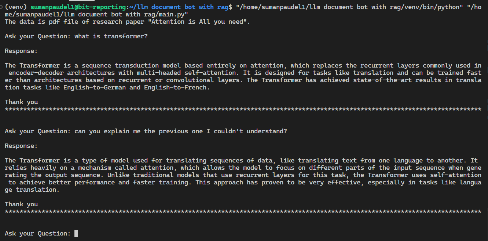
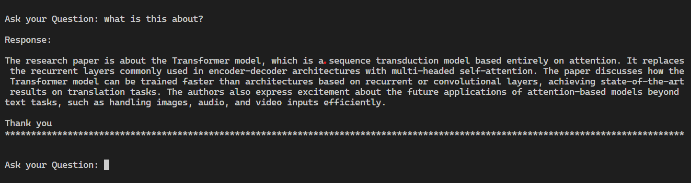
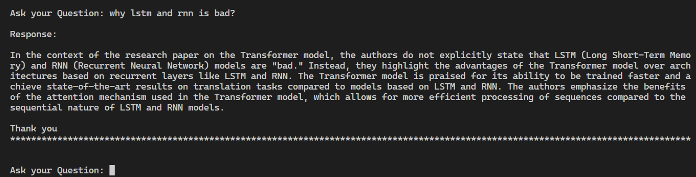

# LLM Document CLI Bot with Rag

A cli based chatbot which helps in reading the context of given documents (PDF)

## Installation

To get started, follow these steps:

- **Using Python**:
    - 1. Clone this repository.
    - 2. Create virtual environment using `python -m venv venv`.
    - 3. If you don't have virtual envrionment the install using `pip install virtualenv`.
    - 4. Activate virtual envrionment `source venv/bin/activate`.
    - 3. Install the required dependencies using `pip install -r requirements.txt`.
    - 4. Run the application with `python main.py`.

- **Using Docker**:
    - 1. create a `.env` file add your api_key OPENAI_API_KEY='yoursecretkey' or do `export OPENAI_API_KEY=<yourkey>`
    - 2. Now build the image using your api key `docker build --build-arg OPENAI_API_KEY=$OPENAI_API_KEY -t <image name> .`
    - 3. Now run the pythin application using  `docker run -it --name my_app --rm <image name>`

## Usage

- Use the app to do query the pdf file.
- The app is purely CLI based where users are prompted to ask the question of their files.
- The app understands the context you are providing with respect to pdf file

## Folder Structure
- **data**: This directory contains all the data files required for the project. 
- **qdrant**: A folder containing qdrant local instance to save the vector emebeddings.
- **utils**: A directory containing utility scripts that are used across the project.
    - `vector_index.py`: Used for creating and managing vector indices.
    - `data_ingestion.py`: This script is used for ingesting data into the application.
    - `qdrant_db.py`: Handles operations related to 'qdrant' database.
- **vector_index**: Folder containing files that stores storage context container which is a utility container for storing nodes, indices, and vectors.
- `requirement.txt` : all of the dependencies needed to run the project.
- `Dockerfile` : Contains dockerized version of application
- `.gitignore` : Contains list of the files that are ignored while pushing. e.g .env file, log files 

## Sample App in Action

Sample 1
- 

Sample 2
- 

Sample 3
- 

